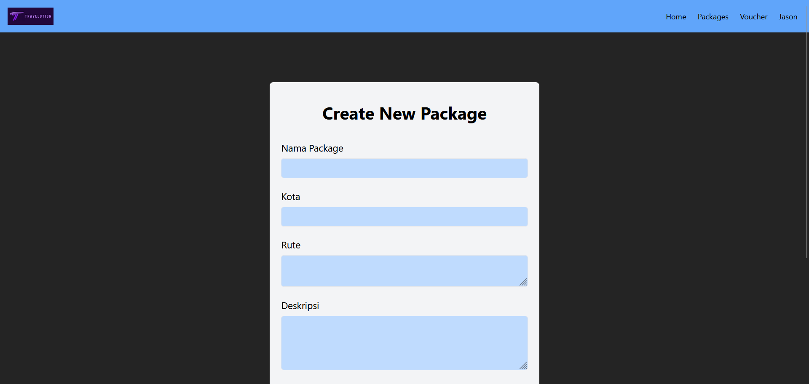
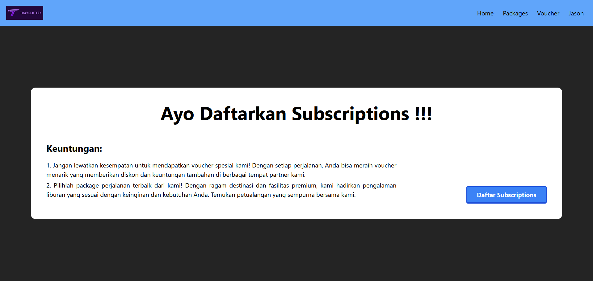

# FrontEnd Travelution Subscription Feature

## Deskripsi
Travelution Subscription merupakan fitur untuk membantu pelayanan Subscription Premium dari user. Fitur yang ditawarkan untuk pengguna yaitu pemesanan packages wisata tertentu yang sudah disediakan perusahaan dan juga sistem diskon dengan menggunakan voucher. Untuk mendapatkan Subscription, pengguna perlu mengajukan request yang dapat dipilah oleh admin untuk proses accept atau rejectnya. Adapun aplikasi ini dibuat untuk memenuhi tugas besar mata kuliah Pemrograman Aplikasi Berbasis Web.

## Requirement App
- NodeJS
- React.js
- Tailwind CSS
- Docker
- Vite
- HTTP Client with Axios

## Screenshot
### Login

### Signup

### Dashboard

### Daftar Package (Admin & User)
##### Admin

##### User

### Detail Package (Admin & User)
##### Admin

##### User

### Add Package

### Update Package

### Daftar Voucher: 13521008
##### Admin

##### User

### Detail Voucher

### Add Voucher

### Daftar Subscriptions

### Acc Reject Subscriptions

### Daftar Subscriptions

### Sudah Subscriptions

### Pilih Voucher

## Cara menjalankan aplikasi
1. Pastikan sudah terinstall semua Requirement yang diperlukan
2. Clone repositori ini
3. Pada terminal, akses folder `cd src/vite-project`
4. Install packages by running `npm install`
5. Jalankan program dengan `npm run dev`

### Pembagian Tugas
1. Login: 13521008
2. Signup: 13521008
3. Dashboard: 13521003
4. Daftar Package:13521008
5. Detail Package (Admin & User): 13521008
6. Add Package: 13521008
7. Update Package: 13521008
8. Daftar Voucher: 13521008
9. Detail Voucher (Admin & User): 13521008
10. Add Voucher: 13521008
11. Daftar Subscriptions: 13521029
12. Acc Reject Subscriptions: 13521029
13. Daftar Subscriptions: 13521029
14. Sudah Subscriptions: 13521029
15. Pilih Voucher: 13521008
